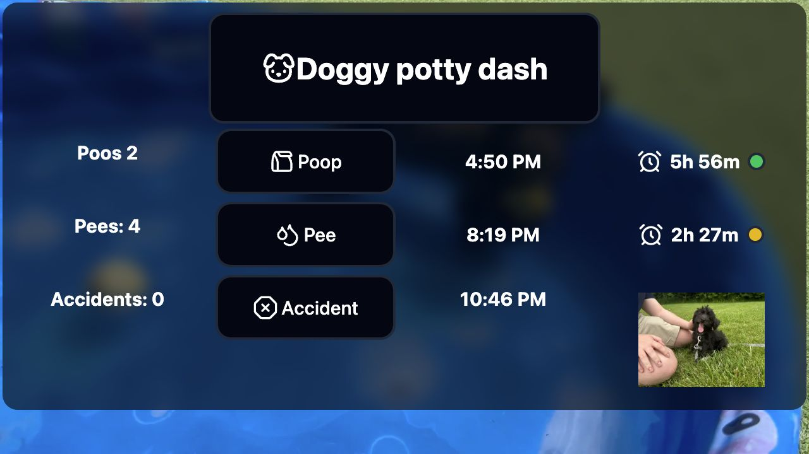

# Mr Stink Stink

> A one-tap potty tracker for our dog, Atlas — live elapsed timers, overdue colour
> coding, and running totals, installable to a phone or wall-mounted touchscreen.

**Live demo:** https://mrstinkstink.com



## Overview

Mr Stink Stink records when Atlas goes out, shows how long it has been since the
last time, and changes colour once he is overdue. It was built because "wait,
when did he last go out?" is a question that gets asked a lot and nobody ever
remembers the answer. It is in daily use.

## Features

- **One-tap logging.** Buttons for poop, pee, and accidents. Each tap writes a
  timestamped row to Supabase.
- **Live elapsed timer.** A ticking counter showing time since the last poop and
  the last pee, updated every second.
- **Overdue colour coding.** The indicator next to each timer moves from green to
  yellow to red as time passes:

  | | yellow | red |
  |---|---|---|
  | pee | 2 hours | 3 hours |
  | poop | 6 hours | 8 hours |

- **Running totals** for poops, pees, and accidents.
- **Installable.** A web app manifest and service worker make it installable to a
  home screen and launchable standalone, so it behaves like a native app.

## Tech stack

Next.js 16 (App Router) · React 19 · TypeScript · Tailwind CSS · Supabase
(Postgres) · deployed to Vercel as a PWA.

## Getting started

```sh
cd app
npm install
npm run dev
```

Supabase credentials go in `app/.env.local`:

```
NEXT_PUBLIC_SUPABASE_URL=...
NEXT_PUBLIC_SUPABASE_PUBLISHABLE_KEY=...
```

The app reads and writes a single `PottyTime` table, with a `time` timestamp
column plus `poop times`, `pee times`, and `accident` flag columns.

## Scripts

| command | what it does |
|---|---|
| `npm run dev` | start the dev server |
| `npm run build` | production build |
| `npm run lint` | ESLint |
| `npm run typecheck` | `tsc --noEmit` |
| `npm run format` | Prettier |

## License

Released under the [MIT License](LICENSE).
